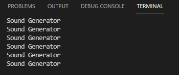

# PRACTICA 7A: Reproducción desde memoria interna
## Codigo:
```
#include "Arduino.h"
#include "FS.h"
#include "HTTPClient.h"
#include "SPIFFS.h"
#include "SD.h"
#include "SPI.h"
#include "AudioGeneratorAAC.h"
#include "AudioOutputI2S.h"
#include "AudioFileSourcePROGMEM.h"
#include "sampleaac.h"

AudioFileSourcePROGMEM *in;
AudioGeneratorAAC *aac;
AudioOutputI2S *out;

void setup(){
  Serial.begin(115200);
  in = new AudioFileSourcePROGMEM(sampleaac, sizeof(sampleaac));
  aac = new AudioGeneratorAAC();
  out = new AudioOutputI2S();
  out -> SetGain(0.125);
  out -> SetPinout(26,25,22);
  aac->begin(in, out);
}

void loop(){
  if (aac->isRunning()) {
    aac->loop();
    } else {

      aac -> stop();
      Serial.printf("Sound Generator\n");
      delay(1000);
  }
}
```

## Descibir la salida por el puerto serie:
Compilamos y ejecutamos el programa. Al monitorearlo, podemos observar que muestra por pantalla la frase "Sound generator". Teniendo a mano un altavoz y connectandolo podemos ecuhar a un señor hablando.



## Explicar el funcionamiento:
Declaramos las librerias necesarias para el amplificador "ESP8266Audio":
```
#include "Arduino.h"
#include "FS.h"
#include "HTTPClient.h"
#include "SPIFFS.h"
#include "SD.h"
#include "SPI.h"
#include "AudioGeneratorAAC.h"
#include "AudioOutputI2S.h"
#include "AudioFileSourcePROGMEM.h"
#include "sampleaac.h"

AudioFileSourcePROGMEM *in;
AudioGeneratorAAC *aac;
AudioOutputI2S *out;
```

Ya en el setup, comenzamos iniciando el serial y continuamos asiganndo la variable in. En el la linea "AudioFileSourcePROGMEM(sampleaac, sizeof(sampleaac));" el qual importa el archivo de audio en el formato '.acc'. En "aac = new AudioGeneratorAAC();" asignamos a esta variable para poder descodificar el audie en el formato. Seguidamente asignamos la variable out para poder establecer la ganancia del audio "out = new AudioOutputI2S();". En los siguientes asignamos los pines de salida y finalmente la última linea es para la entrada y la salida.
```
void setup(){

  Serial.begin(115200);
  in = new AudioFileSourcePROGMEM(sampleaac, sizeof(sampleaac));
  aac = new AudioGeneratorAAC();
  out = new AudioOutputI2S();
  out -> SetGain(0.125);
  out -> SetPinout(26,25,22);
  aac->begin(in, out);
}
```

Finalmente ya en el void loop se inicia primeramente un bucle que haces que se descodifique el acc. Por otra banda si no pude recorrer el bucle se muestra por pantalla y al monitorear el programa se muestra por pantalla el mensaje de "Sound Generator"
```
void loop(){
  if (aac->isRunning()) {
    aac->loop();
    } else {

      aac -> stop();
      Serial.printf("Sound Generator\n");
      delay(1000);
  }
}
```